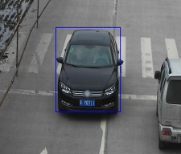
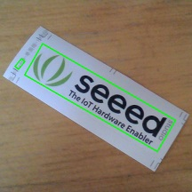
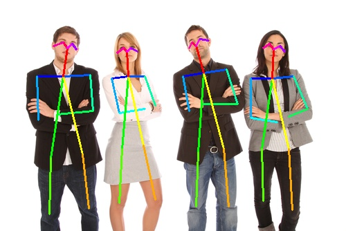
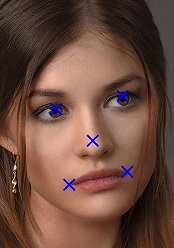
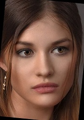
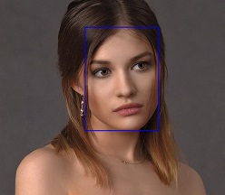

# OpenVINO Open Model Zoo toolkit
## Overview:
 This is a wrapper library for [Open Model Zoo (OMZ)](https://github.com/openvinotoolkit/open_model_zoo) for Intel distribution of OpenVINO toolkit. User can use OMZ models without having deep knowledge of OpenVINO or deep-learning. **This library hides all the mess behind the scene.**  
 User can utilize OpenVINO performance and OMZ algorithms (models) by simple funciton calls.  
 これはIntel distribution of OpenVINO toolkit用のモデルライブラリ、[Open Model Zoo (OMZ)](https://github.com/openvinotoolkit/open_model_zoo)を簡単に利用できるようにするためのラッパーライブラリです。ユーザーはディープラーニングやOpenVINOの知識が無くてもディープラーニングを使った処理を実行可能になります。  
 ユーザーは普通に関数を呼び出すだけでOpenVINOのパフォーマンスとOMZのアルゴリズムを利用可能です。  

## IMPORTANT NOTICE  
- This library uses synchrounous infernence API. OpenVINO can achieve much higher throughput if you use **asynchronous inference API** natively.  
- OpenVINO setting is configurable through setConfig() API. User could achieve much higher performance if the user set the appropriate configuration for the system. This libray doesn't provide interface for it but still the user can use setConfig() API to setup OpenVINO for higher throughput.  
- このライブラリではOpenVINOの同期推論APIしか使用していません。OpenVINOは非同期推論APIを活用することでもっと高いスループットを発揮することが可能です（多くの場合）。  
- このライブラリではサポートしていませんが、setConfig() APIで使用している機材に合わせたセッティングをすることでもっと高い性能を出すことが可能な場合があります。このライブラリを使用していてもsetConfig() APIを使用することは可能です。  

## Description:
This toolkit (library) provides following functions or capabilities:
1. Automatic OMZ model downloading - 自動モデルダウンロード 
  The library will download required OMZ IR models automatically if it's not existing on the computer.  
2. Preprocess and postprocess - 推論プリ/ポストプロセス  
  The library does required preprocess and postprocess for inferencing. User just need to provide an OpenCV image and get the parsed inference result.  

## Prerequisites
Intel OpenVINO toolkit 2020.4.

## Supported models
Supported models are defined in `model_def.yml`.  
Check those files for details.  

## Supported tasks (algorithms)  
The default model for a task is defined in `default_models.yml`.  
- image_classification
- object_detection
- face_detection
- age_gender
- head_pose
- emotion
- face_landmarks
- text_detect
- human_pose (require to build the pose_extractor C++ module to enable this feature)

## How to use
1. Deploy required files to your directory
- `open_model_zoo_toolkit.py`
- `default_models.yml`
- `model_def.yml`
- `labels_coco.txt`
- `labels_imagenet.txt`
- `labels_voc.txt`  
** If you want to use human_pose_estimation **
- `CmakeLists.txt`
- `build-poseextractor.bat` or `build-poseextractor.sh`  
Please follow the instruction in `how to build pose_extractor` section below to build the `pose_extractor` C++ module.  


### Code example - Image classification
```python
import cv2
import open_model_zoo_toolkit as omztk

omz = omztk.openvino_omz()
model = omz.imageClassificator()
#model.setDevice('MYRIAD')  # You can change inference device. Default='CPU'

img = cv2.imread('resources/car.png')
res = model.run(img)
print(res)
# Example: res = [[479, 'car wheel', 0.5016654], [817, 'sports car, sport car', 0.31316656], [436, 'beach wagon, station wagon, wagon, estate car, beach waggon, station waggon, waggon', 0.06171181]]
```

### Code example - Object detection
```python
import cv2
import open_model_zoo_toolkit as omztk

omz = omztk.openvino_omz()
model = omz.objectDetector()                        # Default model will be used
#model = omz.objectDetector('ssd_mobilenet_v2_coco') # Also, you can select a OMZ model from 'model_def.yml' and use it

img = cv2.imread('resources/car_1.bmp')
res = model.run(img)
print(res)
# Example: res = [[1, 'person', 0.9291767, (42, 2), (759, 714)]]

for obj in res:
    cv2.rectangle(img, obj[3], obj[4], color=(255,0,0), thickness=2)
cv2.imshow('result', img)
cv2.waitKey(3 * 1000)       # 3 seconds
```


### Code example - Text detection
```python
import cv2
import numpy as np
import open_model_zoo_toolkit as omztk

omz = omztk.openvino_omz()
model = omz.textDetector()

cap = cv2.VideoCapture(0)

key = 0

img = cv2.imread('resources/textdet.jpg')
rects, imgs = model.run(img)
print(rects)

for rect in rects:
    box = cv2.boxPoints(rect).astype(np.int32)     # Obtain rotated rectangle
    cv2.polylines(img, [box], True, (0,255,0), 4)  # Draw bounding box

cv2.imshow('text', img)
key = cv2.waitKey(3 * 1000)     # 3 sec
```


### Code example - Human pose estimation
```python
import cv2
import open_model_zoo_toolkit as omztk

omz = omztk.openvino_omz()
model = omz.humanPoseEstimator()

img = cv2.imread('resources/people.jpg')
res = model.run(img)
print('*', res)

omztk.renderPeople(img, res)
cv2.imshow('result', img)
cv2.waitKey(3 * 1000)     # 3 sec
```



### Code example - Face detection
```python
import cv2
import open_model_zoo_toolkit as omztk

omz = omztk.openvino_omz()

facedet = omz.faceDetector()
agegen  = omz.ageGenderEstimator()
hp      = omz.headPoseEstimator()
emo     = omz.emotionEstimator()
lm      = omz.faceLandmarksEstimator()

img = cv2.imread('resources/girl.jpg')
detected_faces = facedet.run(img)

for face in detected_faces:
    face_img = omztk.ocv_crop(img, face[3], face[4], scale=1.3)  # Crop detected face (x1.3 wider)
    landmarks         = lm.run(face_img)                         # Estimate facial landmark points

    face_lmk_img = face_img.copy()                               # Copy cropped face image to draw markers on it
    for lmk in landmarks:
        cv2.drawMarker(face_lmk_img, lmk, (255,0,0), markerType=cv2.MARKER_TILTED_CROSS, thickness=4)  # Draw markers on landmarks
    cv2.imshow('cropped face with landmarks', face_lmk_img)
    cv2.waitKey(2 * 1000)  # 2 sec                               # Display cropped face image with landmarks

    yaw, pitch, roll = hp.run(face_img)                          # Estimate head pose (=head rotation)
    face_rot_img = omztk.ocv_rotate(face_img, roll)              # Correct roll to be upright the face

    age, gender, prob = agegen.run(face_rot_img)                 # Estimate age and gender
    emotion           = emo.run(face_rot_img)                    # Estimate emotion

    print(age, gender, emotion, landmarks)
    # Example: 23 female neutral [(112, 218), (245, 192), (185, 281), (138, 369), (254, 343)]

    cv2.imshow('cropped and rotated face', face_rot_img)
    cv2.waitKey(2 * 1000)  # 2 sec

    cv2.rectangle(img, face[3], face[4], (255,0,0), 2)

cv2.imshow('result', img)
cv2.waitKey(3 * 1000)      # 3 sec
```





-----------------------------

### How to build `pose extractor` for human_pose_estimation (Windows)
0. Prerequisites
  - Microsoft Visual Studio (w/C++ build package)
1. Open Microsoft Visual Studio command prompt (`Developer Command Prompt for VSxxxx`)
2. Run `build-poseextractor.bat`
3. You'll have `pose_extractor.pyd` in the current directory.


### How to build `pose_extractor` for human_pose_estimation (Ubuntu 18.04)
1. Open a terminal
2. Run `build-poseextractor.sh`
3. You'll have `libposeextractor.so` in the current directory.

